<p align="center">
  
</p>

<h1 align="center">Stratoseer</h1>
<p align="center"><strong>Your AI board of advisors, scanning ahead.</strong></p>
<p align="center">
  A multi-agent career intelligence system that scouts job openings, certifications, courses, events, communities, and industry trends, then synthesizes them into strategic recommendations, risk assessments, and tailored cover letters.
</p>

---

## What does it do?

You define a career profile (your skills, targets, constraints, and CV). Stratoseer dispatches a network of specialized AI agents that:

1. **Scout** the web for opportunities matching your profile (jobs, certs, courses, events, groups, trends)
2. **Validate** every discovered URL before results reach you
3. **Format and rank** everything it finds with evidence-backed claims
4. **Analyze strategically** via CEO and CFO advisor agents
5. **Generate cover letters** tailored to specific job postings using your CV
6. **Track token usage** per agent with budget enforcement
7. **Audit every step** so you can trace exactly how each result was produced

Everything is governed by policy-as-code (YAML files) that control which agents can access what tools, how many tokens they can spend, and what data crosses agent boundaries. Users authenticate via JWT (or Google OAuth), and can bring their own API key for LLM access.

---

## See it in action

### Dashboard

The dashboard gives you a bird's-eye view: your profiles, recent runs, and quick stats.

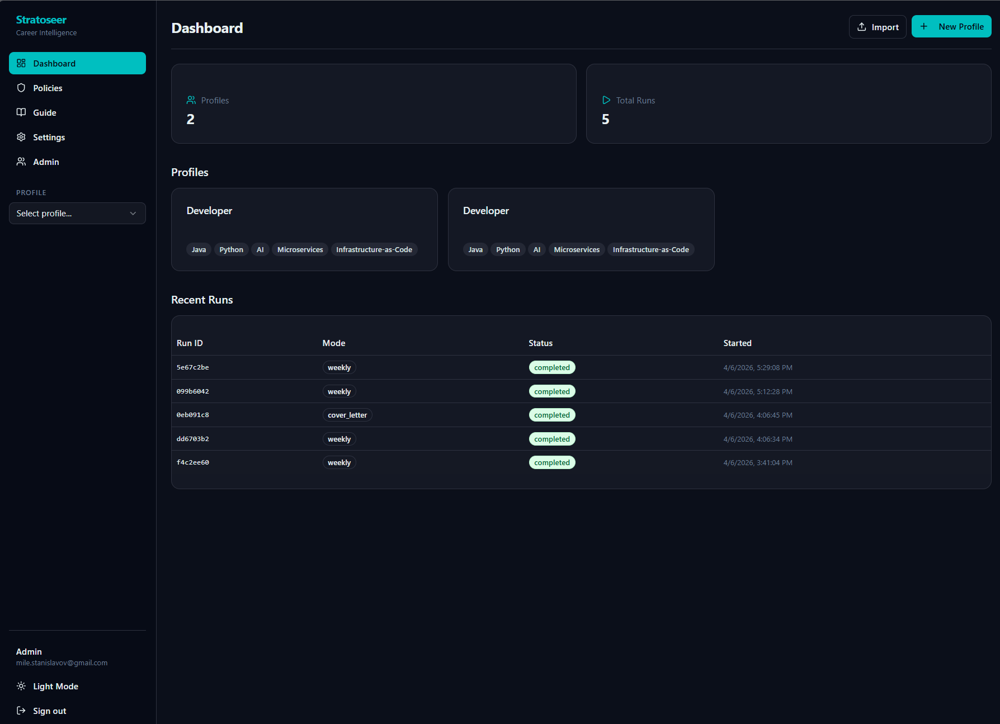

Each profile is an independent workspace. A Developer, a UI/UX Designer, and a Marketing Manager can all coexist, each with their own runs, results, and cover letters.

New to Stratoseer? The **Guide** page in the sidebar walks you through the full workflow step by step: creating a profile, starting a run, reviewing results, generating cover letters, and understanding policies.

---

### Profile setup

Create a profile with your name, targets, constraints, skills, and CV. Skills can be imported directly from an uploaded CV.

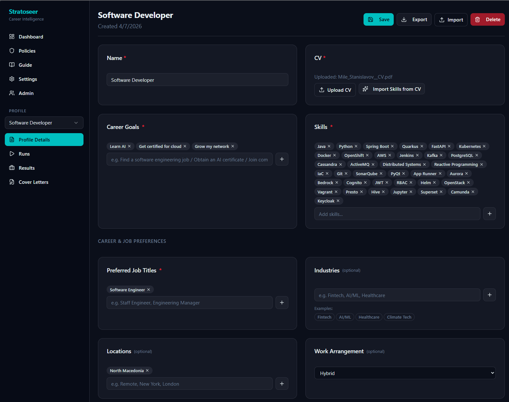

The profile feeds every pipeline. Targets like "certify for AI" or "find a senior-backend job" drive what the scouts search for. Constraints like "hybrid working model" filter what comes back.

---

### Running a pipeline

Trigger a daily, weekly, or cover letter run. Each run records a full audit trail showing every agent that fired, what it produced, and when.

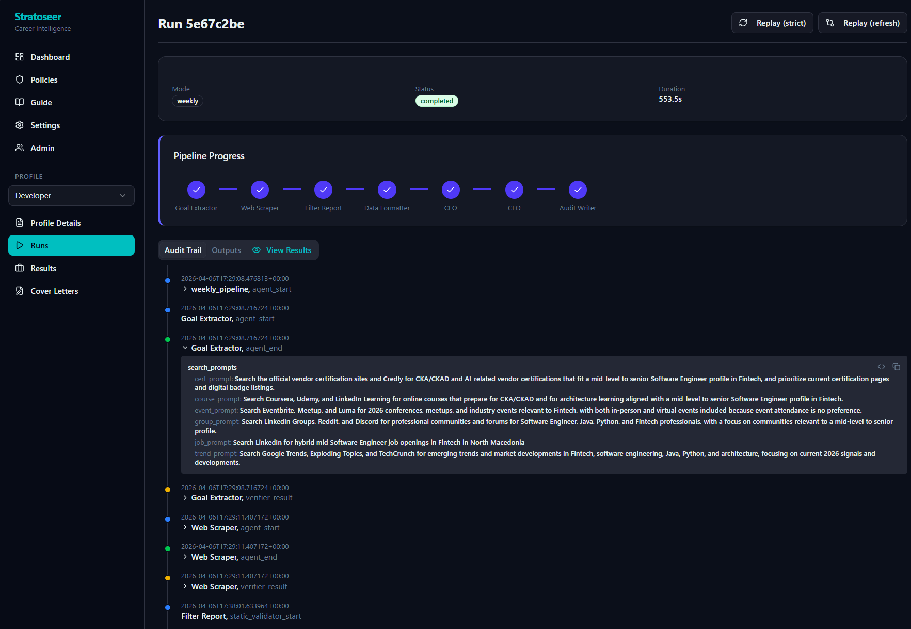

The audit trail is append-only. You can see the `goal_extractor` parse your profile into search prompts, the `web_scrapers` fan out across sources, and every intermediate result along the way.

**Token usage transparency:** The audit trail records exactly how many tokens each agent consumed and which model was used. Navigate to any run's detail page to see a per-agent breakdown of input/output tokens and costs, so you always know where your budget is going.

---

### Results: Jobs

The scouts find real job postings that match your profile. Each result includes a relevance summary and a direct link to the original posting. Job scraping currently targets **LinkedIn only**; support for additional platforms is planned for a future phase.

You can generate a cover letter directly from any job result by clicking the "Generate Cover Letter" action on the opportunities page, without leaving the results view.

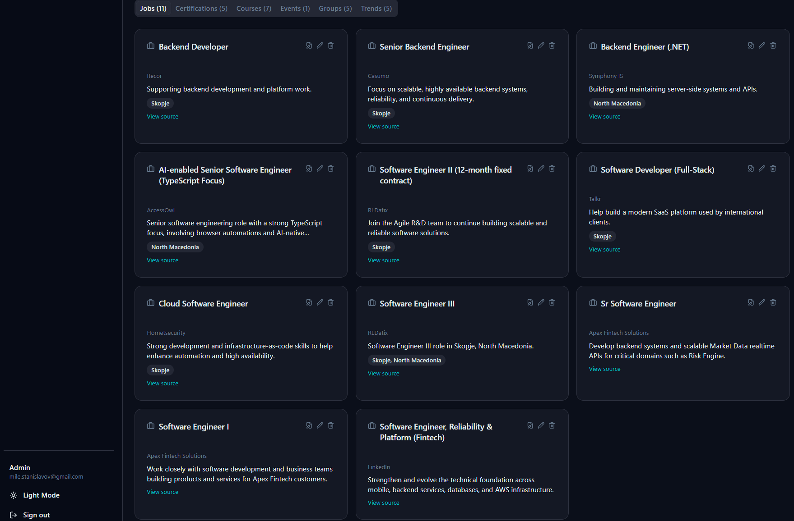

---

### Results: Courses

The same run also surfaces courses from platforms like Udemy and Coursera, matched to your skill gaps and career targets.


Results are organized into tabs: **Jobs**, **Certifications**, **Courses**, **Events**, **Groups**, and **Trends**.

---

### Weekly strategic analysis

A weekly run goes further. After gathering opportunities, the **CEO agent** produces strategic recommendations (prioritized by impact), and the **CFO agent** delivers a risk assessment with time estimates and ROI ratings.

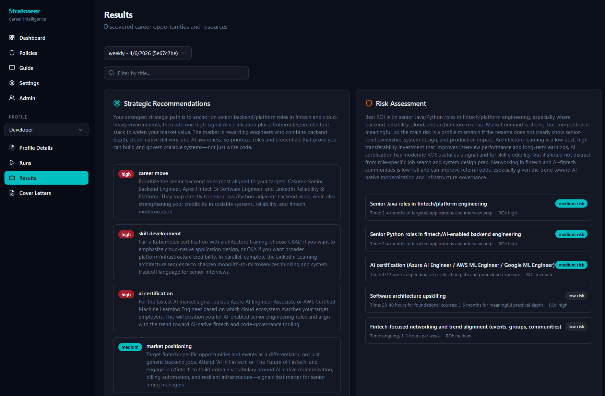

---

### Cover letters

Select a discovered job (or paste a raw job description) and generate a tailored cover letter. You can also trigger this directly from the opportunities page by clicking "Generate Cover Letter" on any job result. The agent reads your CV and the posting, then writes a letter grounded in your actual experience.

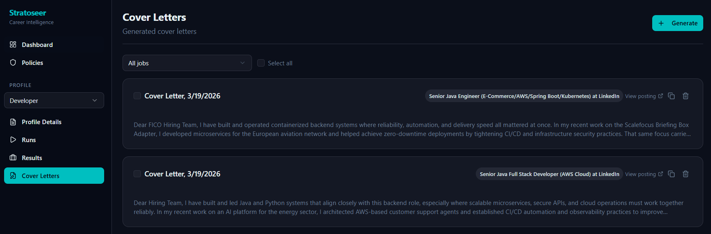

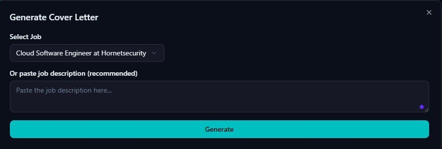

---

### Policies

Every agent in the system is bound by read-only YAML policy files under `policy/`. These are inspectable from the Policies page in the GUI. Four policy files govern all behavior:

- **`tools.yaml`** -- Tool allowlists and denylists per agent. Only web scrapers are permitted to use `web_search` and `web_fetch`. Planners (CEO, CFO), the data formatter, and the cover letter agent are explicitly denied network access and restricted to `llm_structured_output` only.
- **`budgets.yaml`** -- Token limits (input and output) and step budgets per agent. Scraper budgets vary by pipeline mode (daily vs. weekly) and category, with minimum search and result counts enforced.
- **`boundaries.yaml`** -- Data boundary rules defining exactly which fields each agent can read and write. For example, the goal extractor receives only `profile_targets` and outputs only `search_prompts`. No agent can access data outside its declared boundary.
- **`redaction.yaml`** -- PII redaction rules applied to audit logs and run bundles. Emails, phone numbers, and SSNs are automatically replaced with redaction tokens before being persisted.

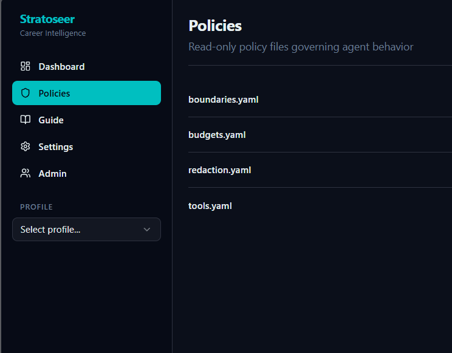

---

### Authentication and BYOK

Stratoseer requires user accounts. Register with email/password or sign in with Google OAuth. An admin panel (accessible to the configured `ADMIN_EMAIL`) lets you manage users.

**Bring Your Own Key (BYOK):** Each user can add their own OpenAI API key in the Settings page. Keys are encrypted at rest. Users without a personal key consume from the server-configured key (if one is set). Run gating in the frontend prevents launching pipelines when no usable key is available. Cover letter generation is unlimited and does not count toward free trial runs -- users can generate as many cover letters as they want without providing their own API key, as long as a server key is configured.

---

## Agent flow

Three pipelines, each a LangGraph `StateGraph`:

### Daily pipeline

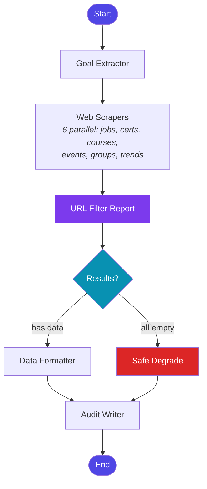

### Weekly pipeline

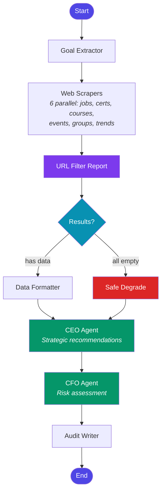

### Cover letter pipeline

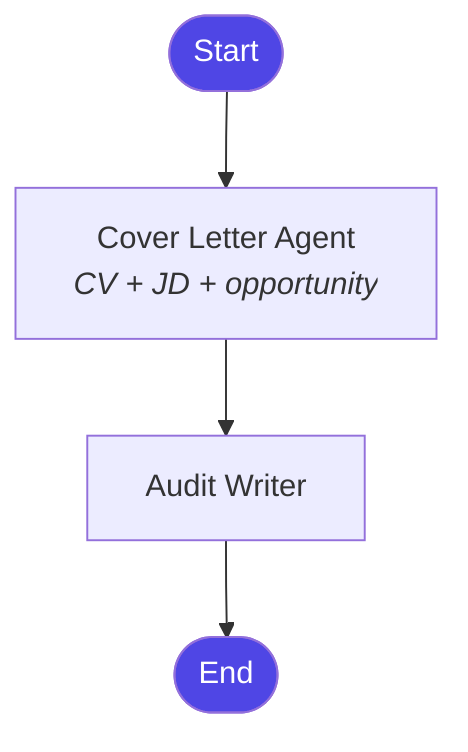

**Key design rules enforced by the policy engine:**

- **Scouts** (web scrapers) can access the network. Planners (CEO/CFO) cannot.
- **URL Filter Report** runs after scraping to validate and filter discovered URLs before formatting.
- **Per-agent token budgets** are enforced at runtime. Each agent has input/output token limits defined in `policy/budgets.yaml`.
- **Safe degradation** activates when all scrapers return empty. The pipeline continues with an explicit partial status rather than failing silently.
- **Audit is terminal.** Every pipeline ends at the audit writer. No conditional exit paths.
- **CEO/CFO always run** in the weekly pipeline, even on empty data, so strategic analysis is always recorded.

---

## Local setup

### Prerequisites

- **Python** 3.11+
- **Node.js** 18+ (for the frontend build)
- **PostgreSQL** 16+ (via Docker or local install)
- **Docker & Docker Compose** (recommended for the database)

### 1. Clone the repository

```bash
git clone https://github.com/CodeMaster10000/stratoseer.git
cd stratoseer
```

### 2. Set up the backend

```bash
python -m venv .venv
source .venv/bin/activate        # Linux / macOS
# .venv\Scripts\activate         # Windows

pip install -e ".[dev]"
```

### 3. Configure environment

Copy `.env.example` and fill in your values:

```bash
cp .env.example .env
```

Key variables:

```env
# Database
POSTGRES_USER=assistant
POSTGRES_PASSWORD=assistant
POSTGRES_DB=assistant
POSTGRES_HOST=localhost
POSTGRES_PORT=5432

# Server
APP_HOST=0.0.0.0
APP_PORT=8000
APP_RELOAD=true

# LLM (required -- no mock agents, a real API key is needed)
API_KEY=sk-...
LLM_MODEL=gpt-4o-mini

# Per-agent model overrides (blank = use LLM_MODEL default)
GOAL_EXTRACTOR_MODEL=
WEB_SCRAPER_MODEL=
DATA_FORMATTER_MODEL=
CEO_MODEL=
CFO_MODEL=
COVER_LETTER_MODEL=

# Auth
JWT_SECRET=change-me-to-a-long-random-string
ADMIN_EMAIL=you@example.com

# Optional: Google OAuth
GOOGLE_CLIENT_ID=
GOOGLE_CLIENT_SECRET=

# Optional: LangSmith tracing
LANGSMITH_TRACING=false
LANGSMITH_API_KEY=
LANGSMITH_PROJECT=Stratoseer
```

See `.env.example` for the complete list including SMTP and deployment settings.

### 4. Start the database

```bash
docker compose up -d
```

### 5. Build the frontend

```bash
cd frontend
npm install
npm run build
cd ..
```

### 6. Run database migrations

```bash
alembic upgrade head
```

### 7. Run the server

```bash
uvicorn app.main:app --reload
```

Open [http://localhost:8000](http://localhost:8000) in your browser.

The API documentation is available at [http://localhost:8000/docs](http://localhost:8000/docs) (Swagger UI) and [http://localhost:8000/redoc](http://localhost:8000/redoc) (ReDoc).

### 8. Run tests

```bash
pytest
```

Tests run against an in-memory SQLite database. No external services needed. The test suite has ~98% code coverage across 901 tests (all LLM calls are mocked).

---

### Frontend development

If you want to work on the frontend with hot reload:

```bash
cd frontend
npm run dev
```

The Vite dev server runs on `http://localhost:5173` and proxies `/api` requests to the FastAPI backend on port 8000.

---

## Deployment

### Docker Compose (local)

The included `docker-compose.yml` provides PostgreSQL and SonarQube:

```bash
docker compose up -d      # Starts Postgres on :5432 and SonarQube on :9000
```

### CI/CD

A GitHub Actions workflow (`.github/workflows/ci.yml`) runs on every push and pull request to `main`:

1. **Lint** -- `ruff check .`
2. **Test** -- `pytest` (901 tests against in-memory SQLite)
3. **Deploy** -- on push to `main` only, triggers a Render deploy hook after lint and tests pass

Pull requests get lint + test feedback without triggering a deployment.

### Render (cloud)

A `render.yaml` blueprint is included for deploy to [Render](https://render.com). It provisions a managed PostgreSQL database and a web service that builds both backend and frontend, then runs Alembic migrations on each deploy. Auto-deploy is disabled -- deployments are gated on the CI pipeline passing.

Set the required environment variables (API_KEY, JWT_SECRET, ADMIN_EMAIL, etc.) in the Render dashboard. Add the Render Deploy Hook URL as a `RENDER_DEPLOY_HOOK_URL` secret in your GitHub repository settings.

---

## Architecture decisions

### Policy-as-code, not convention

Agent behavior is governed by YAML policy files under `policy/`, not by informal coding patterns. The policy engine enforces tool allowlists, token budgets, data boundaries, and PII redaction at runtime. Adding a new agent or changing permissions is a YAML edit, not a code change.

### Deterministic verifier

The verifier is pure Python logic with zero LLM calls. It validates schema conformance, output bounds, title/URL deduplication, job freshness signals, and policy boundary compliance. Each agent has its own check suite dispatched by name. A failure is always explainable by reading the verifier report.

### Immutable audit trail

Every run produces an append-only JSONL log and a bundle JSON capturing input hashes, policy versions, prompt template IDs, tool call hashes, and the verifier report. This enables strict replay and drift detection.

### TypedDict for agents, Pydantic at boundaries

Inter-agent state within LangGraph uses `TypedDict` (idiomatic, lightweight). At API and persistence boundaries, data passes through Pydantic v2 models for validation and documentation.

### Safe degradation over silent failure

When all scrapers return empty, the pipeline explicitly marks the run as partial, logs the reason, and continues through the remaining agents. The audit trail always captures what happened and why.

### Async-first

All agents, the audit writer, and the replay/diff engines are async, benefiting from non-blocking I/O across LLM calls and web scraping.

### Per-agent token tracking

Each agent's input and output tokens are tracked against budgets defined in `policy/budgets.yaml`. Per-mode scraper budgets (daily vs. weekly) allow different search depths. Budget overruns are logged and enforced.

### BYOK with encrypted storage

User-provided API keys are encrypted at rest using Fernet symmetric encryption. The frontend gates run creation on whether a usable key is available (personal or server-level).

### Non-deterministic by nature

The entire system relies on LLM-generated search directives, web scraping, and AI-powered analysis. Results will vary between runs even with identical inputs. We cannot promise 100% accuracy -- URLs may go stale, search engines may return different results, and LLM outputs are inherently non-deterministic. The verifier and audit trail exist to make this variance visible and traceable, not to eliminate it.

### System overview

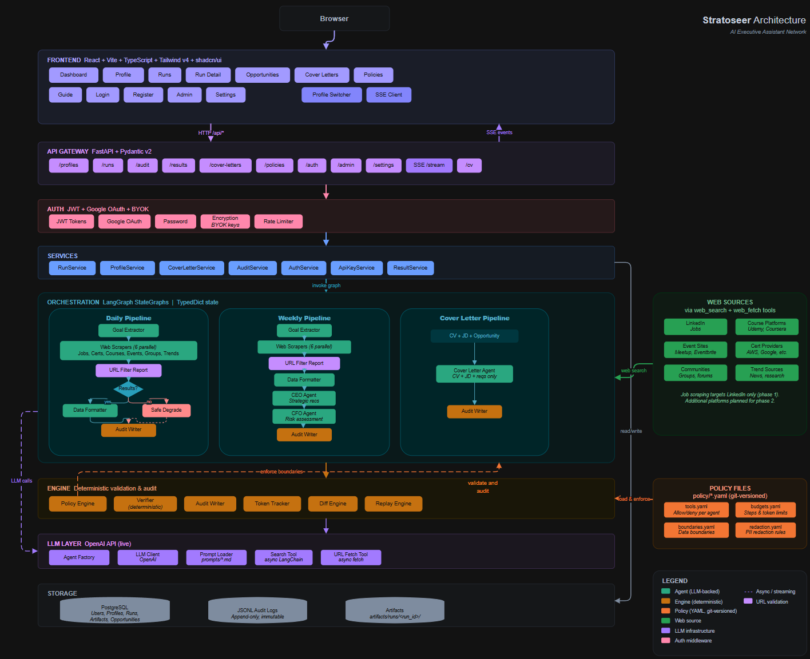

---

## Tech stack

| Layer | Technology                                              |
|---|---------------------------------------------------------|
| Orchestration | LangGraph (StateGraph) + LangChain                      |
| Backend | FastAPI + Pydantic v2                                   |
| Frontend | React + Vite + TypeScript + Tailwind CSS v4 + shadcn/ui |
| Auth | JWT + Google OAuth + BYOK API key encryption            |
| Database | PostgreSQL                      |
| Real-time | Server-Sent Events (SSE)                                |
| Observability | LangSmith tracing (optional) + Built-in Auditing        |
| Policies | YAML under `policy/`                                    |
| CI/CD | GitHub Actions (lint + test + deploy gate)               |
| Deploy | Docker Compose (local) / Render (cloud)                 |
| Testing | pytest + pytest-asyncio + in-memory SQLite              |

---

## License

MIT
